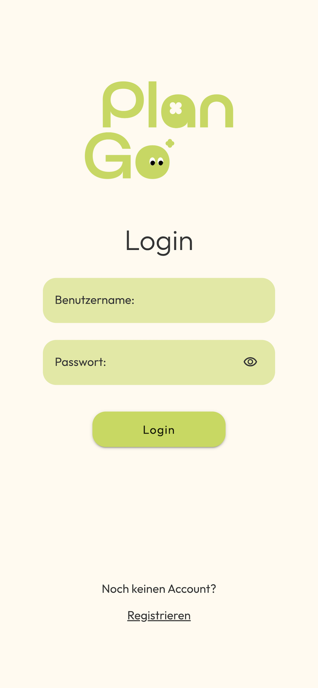
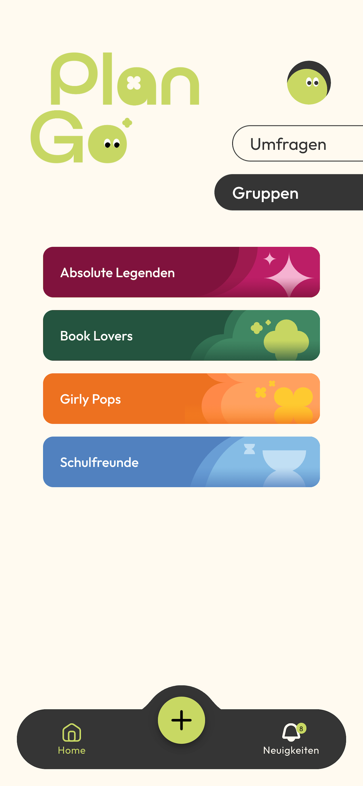
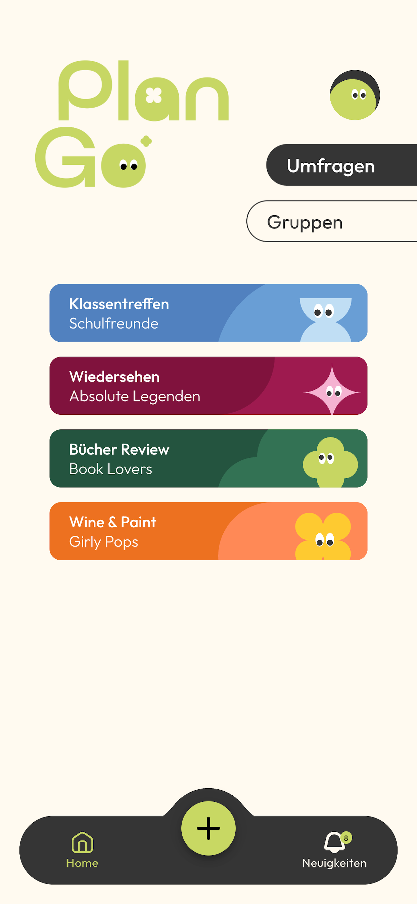
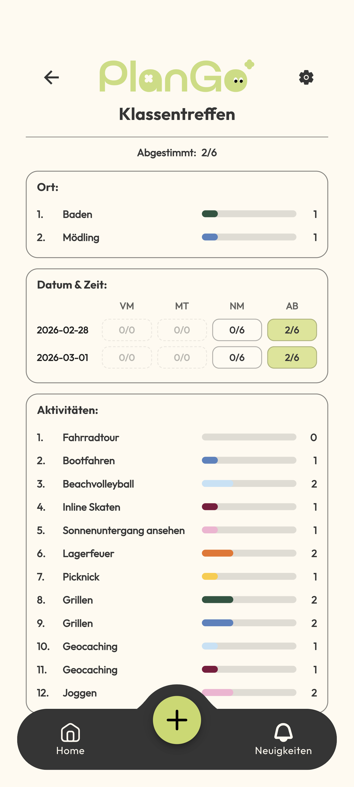
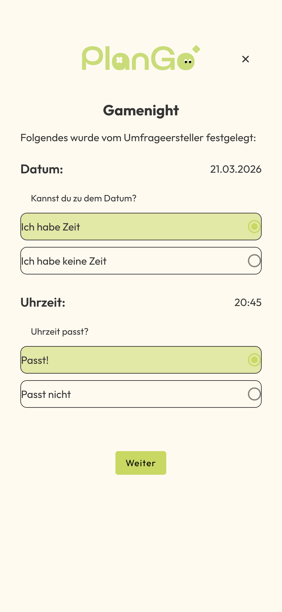
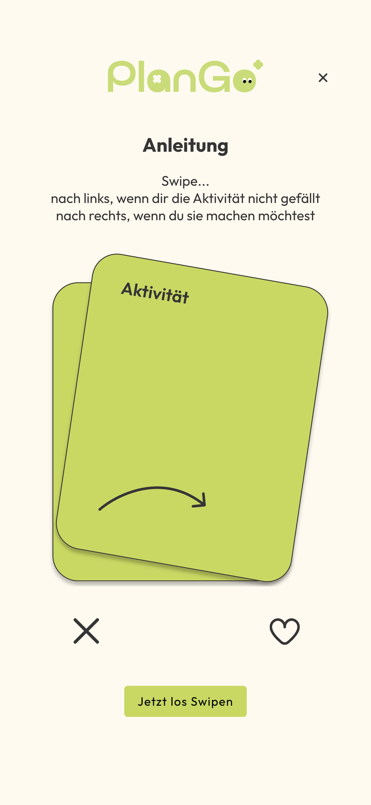
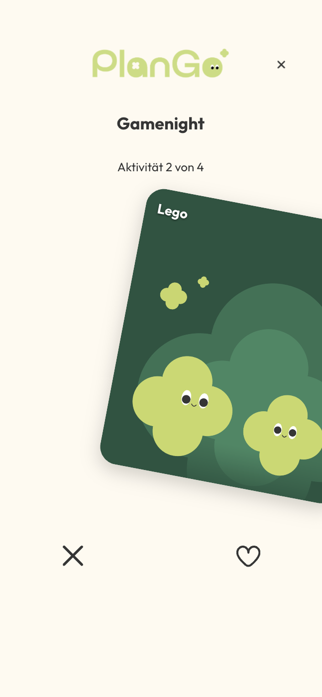
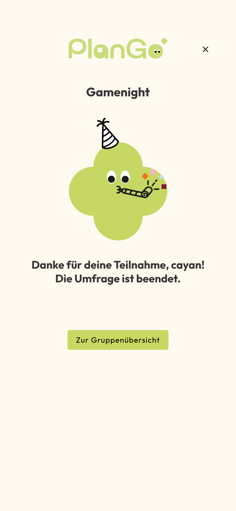

# PlanGo – Group Decision App

PlanGo is a mobile web application that helps groups of friends decide on activities together.  
Users can create groups, start surveys and vote for activities or dates.

---

## My Role

Frontend Developer

Responsibilities:
- Implemented frontend features with **Angular and Ionic**
- Developed UI components and user flows
- Implemented pages such as:
  - Login
  - Register
  - Profile
  - Create Group
  - Create Survey
  - etc
- Assisted with backend integration and API communication

---

## Technologies

Frontend:
- Angular
- Ionic
- TypeScript

Backend:
- Node.js
- REST API

Database:
- MySQL

Mobile Deployment:
- Capacitor (iOS)

---

##  Features

- User authentication (Login / Register)
- Create and manage groups
- Create surveys for activities
- Vote for options and times
- Profile management

---

##  Repository
Repo is private (team project). Access can be granted on request.

Frontend repository: 

https://github.com/cayik/planGoApp-frontend

---

##  What I learned

- Building a mobile web app using Angular + Ionic
- Working in a team with Git
- Implementing features in a larger codebase
- Communicating with backend APIs

---

## Screenshots
| Login | Groups |
|------|------|
|  |  |

| Surveys | Voting |
|------|------|
|  |  |

| Take Survey 1 | Take Survey 2 |
|------|------|
|  |  |

| Take Survey 3 | Take Survey 4 |
|------|------|
|  |  |
